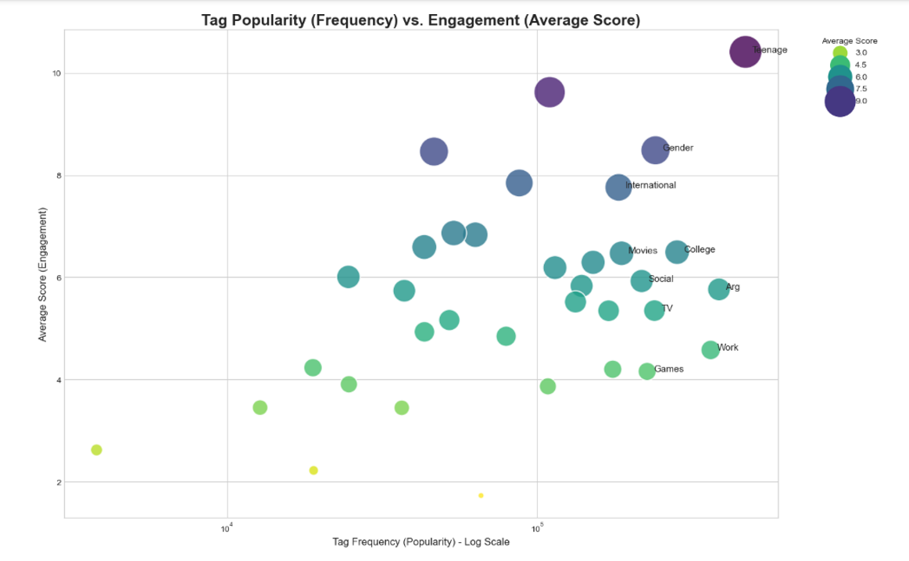
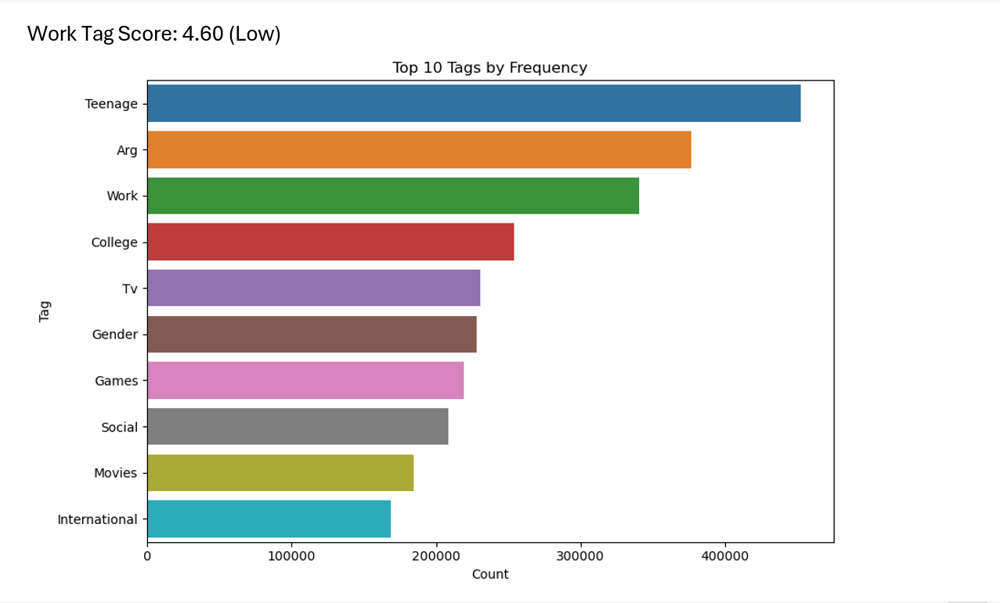
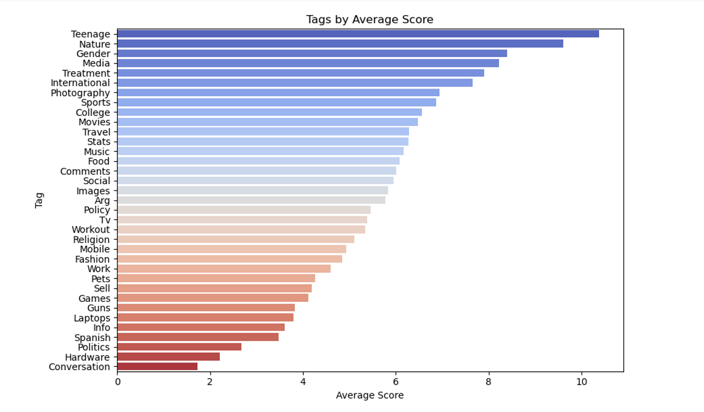
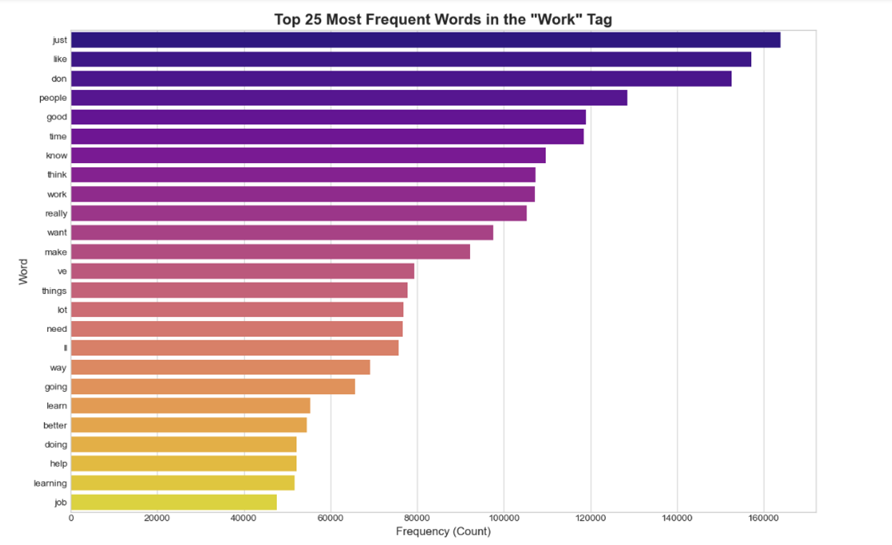
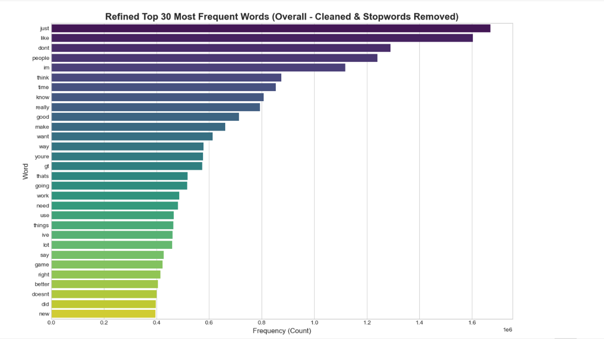

[](https://colab.research.google.com/github/analytics-ak/developer-sentiment/blob/main/developer-sentiment.ipynb)
[](https://mybinder.org/v2/gh/analytics-ak/developer-sentiment/HEAD)
[](https://www.kaggle.com/kernels/welcome?src=https://github.com/analytics-ak/developer-sentiment/blob/main/developer-sentiment.ipynb)


# Developer Sentiment Analysis

## Project Overview
This project takes a closer look at over **4.6 million Stack Overflow posts** to figure out what really makes developers engage with a topic. The idea was simple — find out which kinds of discussions get people talking, and how the tone of a post (whether emotional or factual) changes how others react to it.

While working through the data, I focused on keeping it clean, scalable, and readable. The dataset included **35 tags and 40 topic areas**, so I spent time making sure everything was consistent before diving into analysis.

One clear pattern stood out — posts that felt **personal or emotional** (like “Teenage” or “Nature”) drew far more interest than neutral ones like “Work.” It shows that even in a technical space, people connect most when a post feels human.

The findings from this analysis can help **community teams, product owners, and analysts** understand what kind of content keeps people engaged and how emotional tone can shape user sentiment.

---

## Key Finding
The data made one thing very clear — it’s not how often a topic appears that drives attention, but what it’s about and how it feels.

Posts that show a bit of **emotion or personality** — like “Teenage” or “Nature” — perform much better than neutral or work-related ones. Even though “Work” was one of the most discussed tags, it didn’t connect with readers as much.

In short, **people respond to people — not just information.** When a topic sounds relatable, honest, or personal, engagement goes up naturally.

---

## Tools Used
I used **Python and its core libraries — Pandas, NumPy, Matplotlib, Seaborn, and Scikit-learn** — to clean, explore, and visualize the data. Since the dataset contained millions of rows, I focused on keeping the process **fast, memory-efficient, and easy to scale.**

- **Python 3**
- Pandas – for data cleaning and manipulation  
- NumPy – for numerical operations  
- Matplotlib & Seaborn – for visualizations  
- Scikit-learn (CountVectorizer) – for text and word frequency analysis  
- Re (Regular Expressions) – for removing links and special characters  

---

## Dataset
- **File Name:** `new_tag_data.csv` (from Kaggle)  
- **Total Posts:** 4,594,008  
- **After Cleaning:** 4,376,084 unique posts (removed 217,924 duplicates)

### Columns Studied
- `score` – How many people liked the post  
- `body` – The full text content of the post  
- `Topic` – A number showing the general topic (40 in total)  
- `Tag` – Text label for the post (35 in total)  

---

## Main Insights
Before jumping into charts and numbers, here’s what I noticed while exploring patterns in the data. I compared how often topics appeared with how well they scored and grouped them into categories based on their behaviour. This made it easier to see which tags consistently attract attention — and which ones quietly fade into the background.

### Popularity vs. Engagement
A scatter chart compared how often tags appear vs. how engaging they are:

- **Star Performers (Popular + High Score):** Teenage, Gender  
- **General Chatter (Popular + Low Score):** Work, Arg, Games, Social, College  
- **Hidden Gems (Less Popular + High Score):** Nature, Photography  
- **Less Active (Less Popular + Low Score):** Hardware, Politics  



### Frequency vs. Engagement – The “Work” Tag
Posting more doesn’t mean people will like it. For example, “Work” is the 3rd most used tag but ranks 24th in score. “Teenage” is both the most common and most liked topic.

**Top 5 by Score:**
1. Teenage (10.38)  
2. Nature (9.60)  
3. Gender (8.40)  
4. Media (8.22)  
5. Treatment (7.90)  
**Work Tag Score:** 4.60 (Low)




### Deep Dive on “Work” Tag
I analyzed around 360k posts tagged “Work.” Common words included: *just, like, people, time, know, work, job, company.* These are simple and practical — not emotional — which explains their lower engagement.



### Top 30 Words in All Posts
After cleaning links, symbols, and stopwords, the most frequent words were: **just, like, dont, people, im, think, time, know, really, good.** This shows that most posts are personal and conversational in tone.



---

## Business Uses
Here’s how these insights can be useful beyond just charts and analysis:

- **Growing communities:** Topics like *Nature* and *Photography* may not appear often, but when they do, people love them.  
- **Improving engagement:** Posts with emotion or a story-like tone perform better than purely factual ones.  
- **Quality checks:** Emotional or sensitive tags like *Teenage* or *Gender* often attract strong reactions, so they need extra moderation.  
- **Better recommendations:** Suggest posts from the same “engagement cluster,” not just by similar tags.  
- **Language understanding:** How users discuss *Work* or *Treatment* gives clues about motivation and frustration.

---

## Steps Followed

### Step 1: Load and Clean Data
- Loaded dataset with 4.6M posts  
- Removed 217K duplicates  
- Fixed data types and standardized tag names  
- Optimized memory for better performance  

### Step 2: Explore Data (EDA)
- Analyzed score and tag distributions  
- Found which tags get most attention  
- Built scatterplots comparing popularity and engagement  

### Step 3: Text and Relationship Study
- Used heatmaps to show relationships between Topics and Tags  
- Cleaned and analyzed text for patterns  
- Explored the “Work” tag deeply to understand its lower engagement  

---
## Expected Outcomes
This project looks at over **4.3 million Stack Overflow posts** to find what kind of topics get people most engaged.

You’ll see insights on which tags attract more attention — especially how **emotional topics** compare to **neutral ones** like “Work.” Simple charts and summaries make it easy to spot which topics are popular, hidden gems, or not doing well.

It also shows how Python can handle big text data smoothly and efficiently.

---

## Limitations
- The data covers about **4.6 million posts** collected at one point in time, so newer trends may differ.  
- Only **English-language posts** were analyzed.  
- Some cleaning steps might have removed useful posts or kept a few duplicates.  
- Emotion detection is based on common word use, so it may miss subtle tones or context.  
- The analysis finds **patterns and correlations**, not cause-and-effect relationships.  

---

## Result Summary
In total, the analysis covered over **4.3 million unique posts** and found clear engagement patterns across 35 tags. **Emotional or personal topics scored 2–3× higher** than neutral ones like “Work.”

---

## Final Summary
This project was more than just running numbers — it was about understanding how **real people interact** in a technical space. After studying millions of posts, one theme stood out: **emotion builds connection.**

Posts that sound real, relatable, or personal tend to get noticed more. It’s a reminder that even in a tech community, **human tone still wins.**

This work also shows how large datasets can reveal social behaviour at scale — useful for any product or community team looking to improve engagement. For me, it’s an example of how **data analysis can tell human stories** when you look beyond just numbers.

---

## Links
- **Dataset:** [Kaggle Developer Sentiment Dataset](https://www.kaggle.com/datasets/vaibhavsxn/reddit-comments-labeled-data)   
- **LinkedIn:** [Ashish Kumar Dongre](https://www.linkedin.com/in/analytics-ashish/)


## How to Run the Project
```bash
# 1. Clone the repository
git clone https://github.com/analytics-ak/developer-sentiment.git
cd developer-sentiment

# 2. Install dependencies
pip install pandas numpy matplotlib seaborn scikit-learn

# 3. Run the notebook
jupyter notebook "developer-sentiment.ipynb"

